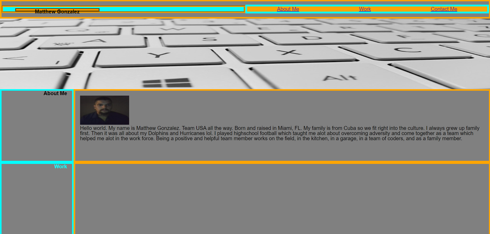

# Challenge2-Portfolio
Matthew Gonzalez

## Description

In this challange we were asked to design our own personal portfolio that we can use in the future along with a resimae. We need to combine html and css elements and a bit of our personality to give off a good first impression in the work force

## Installation

-View source code
-Find semantic HTML elements
-View structure of HTML elements
-Find that elements follow logical structure
-View icon and image elements
-Find accessible alt attributes
-Make sure heading attributes fall in sequential order 

## Usage

This is the new and improved home page

Direct link to website

    file:///C:/Users/13059/Desktop/bootcamp/challenges/Challenge1-Code-Refactoring/index.html

## Credits

For help on which HTML semantic elements to use as propper replacements I used W3Schools.

https://www.w3schools.com/html/html5_semantic_elements.asp

For help with CSS selectors i also referred to W3Schools.

https://www.w3schools.com/CSS/css_selectors.asp

## License

MIT License

